# Task 3: Django 웹앱 만들기 (Part 1) 

## Use case: 
- Copilot에게 Custom instruction을 제공하여 원하는 형태로 코드 제안을 받습니다.
- Chat Mode를 설정하여, Agent 모드에서 기본 제공 모드 외에 원하는 커스텀 모드를 설정해 봅니다.
- (선택사항) GitHub MCP Server를 설정하는 방법을 익힙니다. (이후 Task 4에서 실습)

## 목표:
- Django 기반 메모장 프로젝트를 구성하기 위해, 또 원하는 형태로 코드를 제안받기 위해, Copilot에게 Custom instruction의 종류와 가능한 방법들을 익히고, 생성 방법을 익힙니다. 
- Chatmode를 설정하여, Agent 모드에서 기본 제공 모드 외에 'Plan' 모드를 설정하여, Django 프로젝트를 빌드하기 위한 절차를 제안 받습니다.  
- (선택사항) GitHub MCP Server를 설정하는 방법을 실습합니다.

## Step 1: 새로운 프로젝트 시작하기
- VS Code에서 새로운 프로젝트를 생성합니다.
- 파일 - New window를 선택하고, 새로운 폴더를 선택하여 새 프로젝트를 시작합니다. <br>
 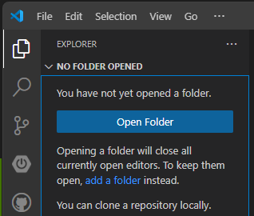 <br>

## Step 2: Custom instructions 생성
 - [Custom instructions 설명](https://docs.github.com/en/enterprise-cloud@latest/copilot/how-tos/custom-instructions/adding-repository-custom-instructions-for-github-copilot?versionId=enterprise-cloud%40latest&tool=jetbrains#about-repository-custom-instructions-for-github-copilot-chat)
 - 팀의 작업 방식, 사용하는 도구, 프로젝트의 세부 사항에 대한 충분한 컨텍스트를 제공하면 GitHub Copilot은 이에 맞춘 챗 응답을 생성할 수 있습니다. 이러한 컨텍스트 정보를 매번 챗 질문에 반복해서 추가하는 대신, 저장소에 파일을 생성하여 자동으로 이 정보를 추가할 수 있습니다. 추가된 정보는 챗에 표시되지는 않지만, Copilot이 더 높은 품질의 응답을 생성하는 데 활용됩니다.

 - **[Custom instructions란](https://code.visualstudio.com/docs/copilot/copilot-customization)** 
    - 일반적인 가이드라인이나 규칙을 정의하여 코드 생성, 코드 리뷰 수행, 또는 커밋 메시지 생성과 같은 작업을 수행합니다. Custom instructions는 AI가 작업을 수행해야 하는 조건(작업이 어떻게 수행되어야 하는지)을 설명합니다.
    - Custom instructions는 다양한 형태로 작성할 수 있습니다. <br>
	- VS Code의 설정 메뉴에서 아래 3가지 설정을 통해, Custom instructions 파일을 지정할 수 있습니다. 아래 표는 Custom instructions를 작성할 수 있는 방법을 정리한 것입니다. <br>

    | Custom instructions 유형 | 설명 |
	|-|-|
	| `.github/copilot-instructions.md` 파일 | - 코드 생성 지침을 Markdown 형식으로 작성합니다.<br>- 모든 지침은 하나의 파일로 결합되어 워크스페이스에 저장됩니다.<br>- 지침은 모든 챗 요청에 자동으로 포함됩니다.<br>- Copilot을 지원하는 모든 에디터와 IDE에서 지원됩니다.<br>- 이 파일을 사용하여 모든 코드 생성 작업에 적용되는 일반적인 코딩 관행, 선호 기술, 프로젝트 요구 사항을 정의합니다. |
	| `.instructions.md` 파일 | - 코드 생성 지침을 Markdown 형식으로 작성합니다.<br>- 워크스페이스 또는 사용자 프로필에 저장된 하나 이상의 지침 파일을 생성합니다.<br>- glob 패턴을 사용하여 모든 요청 또는 특정 파일에 대한 지침을 자동으로 포함합니다.<br>- VS Code에서 지원됩니다.<br>- 작업별 코드 생성 지침을 정의하고, 챗 프롬프트와 함께 지침을 포함할 시점을 더 잘 제어하려면 이 파일을 사용합니다. |
	| VS Code `settings.json` 설정 | - VS Code 사용자 또는 워크스페이스 설정에서 지침을 지정합니다.<br>- 설정 값 또는 하나 이상의 파일에서 지침을 정의합니다.<br>- VS Code에서 지원됩니다.<br>- 코드 생성, 테스트 생성, 커밋 메시지, 코드 리뷰, PR 제목 및 설명에 대한 지침을 지원합니다.<br>- 코드 생성 외의 작업에 대한 지침을 정의하려면 이 옵션을 사용합니다. |

    
	### 2-1. `.github/copilot-instructions.md` 파일 생성
	  - Copilot은 `.github/copilot-instructions.md` 파일을 사용하여, 코드 생성 지침을 Markdown 형식으로 작성합니다. 
	  - 이 파일은 모든 챗 요청에 자동으로 포함되며, Copilot을 지원하는 모든 에디터와 IDE에서 지원됩니다.
	  - 이 파일을 사용하여 모든 코드 생성 작업에 적용되는 일반적인 코딩 관행, 선호 기술, 프로젝트 요구 사항을 정의합니다.
	  - 예시로 제공된 파일을 참고하여, 프로젝트에 맞는 지침을 작성합니다.
      - [copilot-instructions예](https://docs.github.com/en/enterprise-cloud@latest/copilot/how-tos/custom-instructions/adding-repository-custom-instructions-for-github-copilot?tool=vscode#repository-custom-instructions-example) <br>


	````markdown
	# Project Overview

	This project is a web application that allows users to manage their tasks and to-do lists. It is built using React and Node.js, and uses MongoDB for data storage.

	## Folder Structure

	- `/src`: Contains the source code for the frontend.
	- `/server`: Contains the source code for the Node.js backend.
	- `/docs`: Contains documentation for the project, including API specifications and user guides.

	## Libraries and Frameworks

	- React and Tailwind CSS for the frontend.
	- Node.js and Express for the backend.
	- MongoDB for data storage.

	## Coding Standards

	- Use semicolons at the end of each statement.
	- Use single quotes for strings.
	- Use function based components in React.
	- Use arrow functions for callbacks.

	## UI guidelines

	- A toggle is provided to switch between light and dark mode.
	- Application should have a modern and clean design.
	````

	- <참고> VS Code의 설정 메뉴에서 관련 설정 <br>
		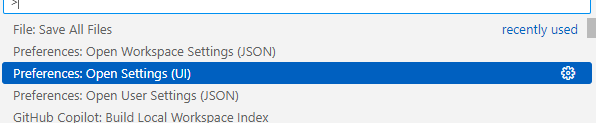 <br>
		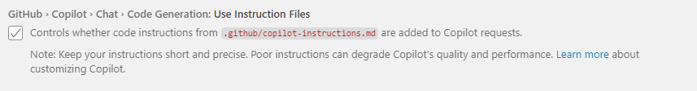<br>

	### 2-2. `.instructions.md` 파일 생성
      - 특정 작업에 대한 사용자 정의 지침을 저장하기 위해 하나 이상의 `.instructions.md` 파일을 생성할 수 있습니다. 예를 들어, 다양한 프로그래밍 언어, 프레임워크 또는 프로젝트 유형에 대한 지침 파일을 생성할 수 있습니다. VS Code는 모든 채팅 요청에 지침 파일을 자동으로 추가하거나, 특정 파일에 대해 지침이 자동으로 적용되도록 지정할 수 있습니다. 또는 채팅 프롬프트에 지침 파일을 수동으로 첨부할 수도 있습니다.
	  - Workspace 또는 User 프로필에 하나 이상의 지침 파일을 생성하여 사용할 수 있습니다.
	  
	    - 워크스페이스 지침 파일: 워크스페이스 내에서만 사용할 수 있으며, 워크스페이스의 .github/instructions 폴더에 저장됩니다.
		- User 프로필 지침 파일: 여러 워크스페이스에서 사용할 수 있으며, 현재 VS Code 프로필에 저장됩니다.
	
	  - Instructions 파일 구조
	    - 헤더 (선택사항)
		  - description: 지침 파일에 대한 설명을 작성합니다. Chat view에서 마우스를 올리면 이 내용이 표시됩니다.
		  - applyTo: 지침 파일이 적용되는 파일을 지정합니다. glob 패턴을 사용하여 특정 파일에만 적용할 수 있습니다.
		  - 예시: 
		    ```markdown
		    # My Custom Instructions
		    description: This file contains custom instructions for my project.
		    applyTo: '**/*.py'
		    ```		

	    - Body
		  - 마크 다운 형식의 자연어로 작성합니다. Heading, Lists, Code blocks 등을 사용하여 지침을 작성합니다.
		  - 다른 instructions 파일을 링크로 참조할 수 있습니다. 

	    - [instructions 파일 예시](https://code.visualstudio.com/docs/copilot/copilot-customization#_custom-instructions-examples) <br>	  

		- Default로 .github/instructions 디렉토리를 사용하고, VS Code의 설정 메뉴에서 사용자가 원하는 디렉토리를 추가 지정할 수 있습니다. <br>
		  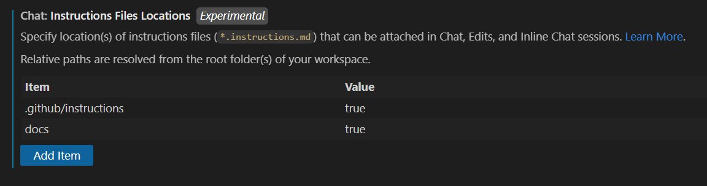 <br>

	### 2-3. VS Code 설정 : settings.json
	  - "text", 혹은 "file"을 지정할 수 있습니다. 

	  - ** 이전 VS Code의 설정에서 `codeGeneration`과 `testGeneration` 설정을 VS Code 1.102 버전부터 deprecated 되었습니다. 

	 	| Instruction 유형                | 설정 이름                                           |
		|---------------------------------|----------------------------------------------------|
		| 코드 리뷰                       | `github.copilot.chat.reviewSelection.instructions` |
		| 커밋 메시지 생성                | `github.copilot.chat.commitMessageGeneration.instructions` |
		| 풀 리퀘스트 제목 및 설명 생성   | `github.copilot.chat.pullRequestDescriptionGeneration.instructions` |
		| 코드 생성 (Deprecated)          | `github.copilot.chat.codeGeneration.instructions` |
		| 테스트 생성 (Deprecated)        | `github.copilot.chat.testGeneration.instructions` |

	  - [설정예시](https://code.visualstudio.com/docs/copilot/copilot-customization#_specify-custom-instructions-in-settings) <br>


## Step 3: Custom instructions 작성법 및 권고 
- 프로젝트의 목적, 기능에 대한 상위 수준의 정의
- 기술 스택, 사용되는 (선호하는) 라이브러리와 프레임 워크 and frameworks
- 프로젝트 구조 및 파일 구성
- 코드 스타일 및 컨벤션
- 주석 및 문서화 스타일
- 디자인 패턴 및 아키텍처 원칙
- 테스트 전략 및 프레임워크 
- 보안 및 성능 고려 사항

### 3-1. Custom instructions 생성에 대한 팁
- [설명링크](https://code.visualstudio.com/docs/copilot/copilot-customization#_tips-for-defining-custom-instructions)

- 지침은 간결하고 독립적으로 작성하세요. 각 지침은 하나의 간단한 문장이어야 합니다. 여러 정보를 제공해야 하는 경우, 여러 개의 지침으로 나누어 작성하세요.

- 지침에서 특정 코딩 표준과 같은 외부 리소스를 참조하지 마세요.

- 지침을 여러 파일로 분리하세요. 이 방법은 주제나 작업 유형별로 지침을 정리하는 데 유용합니다.

- 지침 파일에 지침을 저장하여 팀이나 프로젝트 간에 쉽게 공유할 수 있도록 하세요. 또한 파일을 버전 관리하여 시간 경과에 따른 변경 사항을 추적할 수 있습니다.

- 지침 파일 헤더의 `applyTo` 속성을 사용하여 특정 파일이나 폴더에 지침을 자동으로 적용하세요.

- 프롬프트 파일에서 사용자 정의 지침을 참조하여 프롬프트를 깔끔하고 집중되게 유지하고, 다른 작업에 대해 지침을 중복 작성하지 않도록 하세요.


## Step 4: Custom instructions 파일 생성, 수정하기 
- Custom instructions를 생성하기 위해, Copilot Chat창의 우측 상단에 톱니 바퀴 아이콘을 클릭하여 설정 메뉴를 엽니다. <br>
	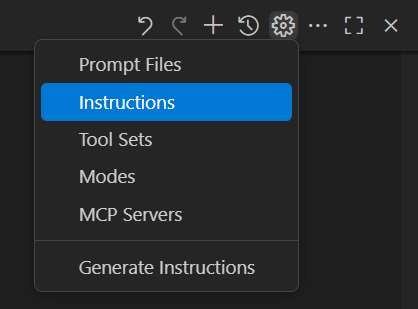 <br>
	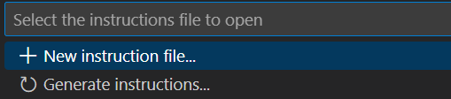 <br>
	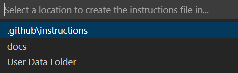 <br>

- 예제로 제공된 현재 디렉토리의 `.github/instructions` 디렉토리의 파일을 복사하여 활용합니다. <br>

- 현재의 custom instructions 파일을 수정하려면, Copilot Chat창의 우측 상단에 톱니 바퀴 아이콘을 클릭하고, 수정을 원하는 파일을 선택합니다. <br>
	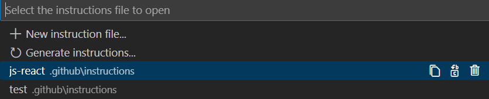 <br>

### 4-1. 기존 프로젝트에서 custom instructions 생성하기
- Copilot Chat창의 우측 상단에 톱니 바퀴 아이콘을 클릭하고, `Generate Instructions`를 선택합니다. <br>
	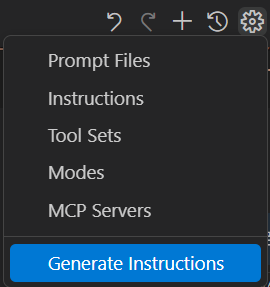 <br>


## Step 5: 커스텀 Chat Mode 설정하기 
- Copilot Chat Mode를 설정하기 전, Copilot Chat의 기본 3가지 모드를 확인해 봅니다. <br>

| 챗 모드 | 설명  |
|---------------|------------------------------------------------------------------------------------------|
| Ask 모드     | Ask 모드는 코드베이스, 코딩, 일반 기술 개념에 대한 질문에 답변하는 데 최적화되어 있습니다. <br> 질문 모드를 사용하여 코드가 어떻게 작동하는지 이해하거나, 소프트웨어 디자인 아이디어를 브레인스토밍하거나, 새로운 기술을 탐구할 수 있습니다. <br> |
| Edit 모드     | Edit 모드는 프로젝트의 여러 파일에서 코드 편집을 수행하는 데 최적화되어 있습니다. <br> VS Code는 코드 변경 사항을 편집기에 직접 적용하며, 그곳에서 변경 사항을 검토할 수 있습니다. <br> 편집 모드는 변경하려는 내용을 잘 이해하고, 어떤 파일을 편집할지 알고 있을 때 코딩 작업에 사용합니다. <br> |
| Agent 모드 | Agent 모드는 프로젝트의 여러 파일에서 자동으로 편집을 수행하는 데 최적화되어 있습니다. <br> 에이전트 모드는 명확히 정의되지 않은 작업을 수행해야 하며, 터미널 명령 및 도구 실행이 필요할 수 있는 경우 코딩 작업에 사용합니다. <br> |

- 커스텀 챗 모드는 특정 모드로 전환할 때 적용되는 지침과 도구 세트로 구성됩니다. 예를 들어, "Plan" 챗 모드는 구현 계획을 생성하기 위한 지침을 포함하고 읽기 전용 도구만 사용할 수 있습니다. 커스텀 챗 모드를 생성하면 관련 도구와 지침을 매번 수동으로 선택하지 않고도 해당 구성으로 빠르게 전환할 수 있습니다.
- [VS code 설명링크](https://code.visualstudio.com/docs/copilot/chat/chat-modes)
- 커스텀 챗 모드는 `.chatmode.md`라는 Markdown 파일로 정의되며, 워크스페이스에 저장하여 다른 사람들이 사용할 수 있도록 하거나 사용자 프로필에 저장하여 다양한 워크스페이스에서 재사용할 수 있습니다.

### 5-1. Chat mode 구조
   - 메타데이터 헤더
     - description: 챗 모드에 대한 간단한 설명입니다. 이 설명은 챗 입력 필드의 자리 표시자 텍스트로 표시되며, 챗 모드 드롭다운 목록에서 해당 모드 위에 마우스를 올릴 때 표시됩니다.
     - tools: 이 챗 모드에서 사용할 수 있는 도구 또는 도구 세트의 목록입니다. 여기에는 기본 제공 도구, 도구 세트, MCP 도구 또는 확장 프로그램에서 제공하는 도구가 포함될 수 있습니다. 사용 가능한 도구 목록에서 도구를 선택하려면 도구 구성 작업을 사용하십시오.
     - model: 프롬프트를 실행할 때 사용할 AI 모델입니다. 지정하지 않으면 모델 선택기에서 현재 선택된 모델이 사용됩니다.

   - Body with chat mode instructions

     - 이곳은 특정 프롬프트, 지침 또는 해당 챗 모드에서 AI가 따라야 할 기타 관련 정보를 제공하는 곳입니다. Markdown 링크를 사용하여 지침 파일을 참조할 수도 있습니다. 챗 모드 지침은 챗 프롬프트에 지정된 내용을 보완합니다.

- [Chat mode 파일 예시](https://code.visualstudio.com/docs/copilot/chat/chat-modes#_chat-mode-file-example) <br>

### 5-2. Chat mode 파일 생성 
  - 'Ctrl + Shift + P'를 눌러 명령어 팔레트를 열고, `Chat: New Mode File`를 선택합니다. <br>
  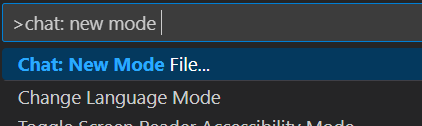 <br>

- VS Code의 설정 메뉴에서 파일 위치를 추가할 수 있습니다. <br>
  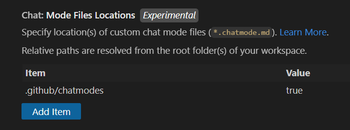 <br>

- 실습 디렉토리에 [plan.chatmode.md](.github/plan.chatmode.md) 파일의 내용을 참조하여 plan 모드를 생성합니다. <br>


## (선택사항) Step 6: GitHub 저장소와 연동하기
- 이 Step의 실습은 선택 사항입니다. (GitHub.com 활용이 불가능한 환경이면, 이 Step은 건너뜁니다.)
- GitHub Enterprise 혹은, GitHub 개인 계정에 빈 저장소를 생성합니다. <br>
- VS Code 왼편의 Git 아이콘을 클릭하고 , `Initialize Repository`를 클릭하여 Git 저장소를 초기화합니다. <br>
- Git commit 메세지 창 우측의 '...' 버튼을 클릭하고 `Remote > Add Remote`를 선택하여, 저장소를 추가합니다. <br>
 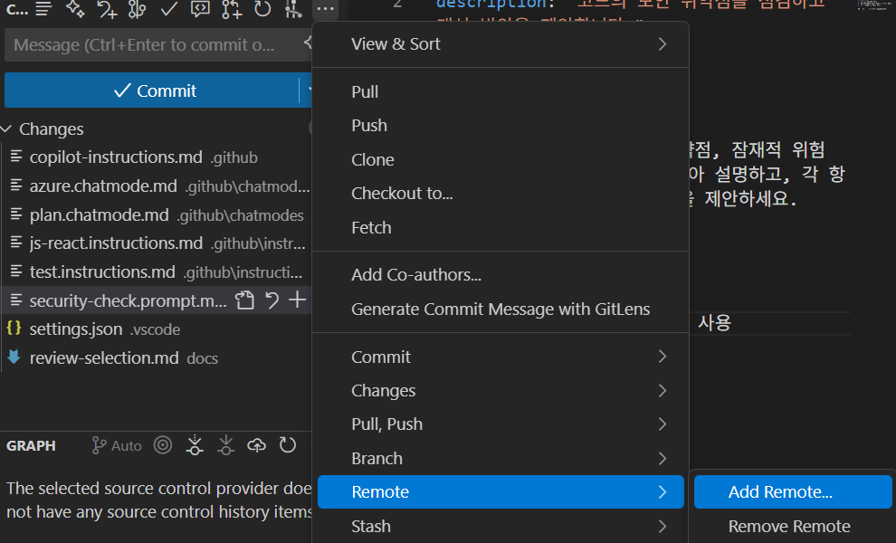 <br>


## (선택사항) Step 7: GitHub MCP Server 설정하기
- MCP Server에 대한 설명은 [Task 8](../Task08/README.md)에서 자세히 다룹니다.
- 현재 Task에서는 GitHub MCP Server를 설정하여, 다음 Task04에서 실제 프로젝트를 구성할 때, Copilot Chat에서 GitHub MCP Server를 이용해, GitHub 저장소에 Issue를 등록할 수 있도록 합니다. <br>
- GitHub MCP Server(https://github.com/github/github-mcp-server) 는 GitHub에서 제공하는 공식 MCP 서버로, GitHub.com의 각종 다양한 기능을 제공합니다. <br>
- GitHub MCP Server를 추가하기 위해 위 링크의 저장소에서 'Remote GitHub MCP Server'하단에 `VS Code: Install Server` 버튼을 클릭합니다. <br>
 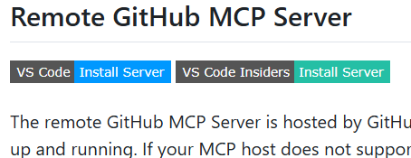 <br>

- 혹은 로컬에 Docker를 설치하고, Docker를 이용해 랩탑에서 GitHub MCP Server를 실행할 수 있습니다. (위 저장소의 `Local GitHub MCP Server` 부분) <br> 
- 추가된 GitHub MCP Server를 확인하기 위해, Agent 모드의 도구 모양 아이콘을 클릭하여 도구 목록을 확인합니다. <br>
  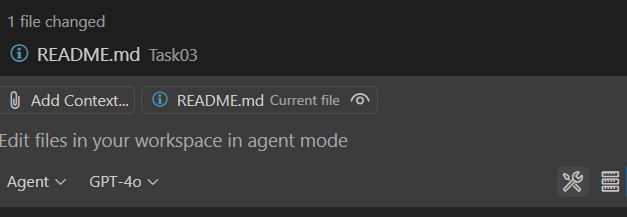 <br>
  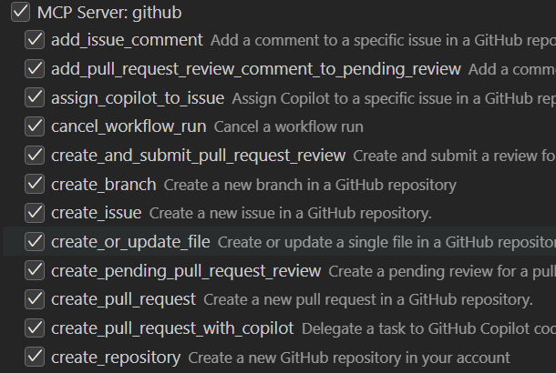 <br>

- 온프렘 설치형 GitHub Enterprise Server를 사용하는 경우, 아래링크의 설명 방법으로 MCP 서버를 설정할 수 있습니다. <br>
  - [GitHub Enterprise Server에서 MCP 서버 설정](https://github.com/github/github-mcp-server#github-enterprise-server-and-enterprise-cloud-with-data-residency-ghecom) <br>

## Step 8: 저장
- Ctrl + Shift + P를 눌러 명령어 팔레트를 열고, `File: Save All Files`를 선택합니다. <br>

## 지식 확인
- 이번 Task에서는 Django 프로젝트를 시작하기 위해, 
  - Copilot의 Custom instructions를 생성하고, 
  - 커스텀 Chat mode를 설정하고,  Remote GitHub 저장소와, GitHub MCP server를 설정하여 Django 웹앱을 만들기 위한 준비를 마쳤습니다. 
